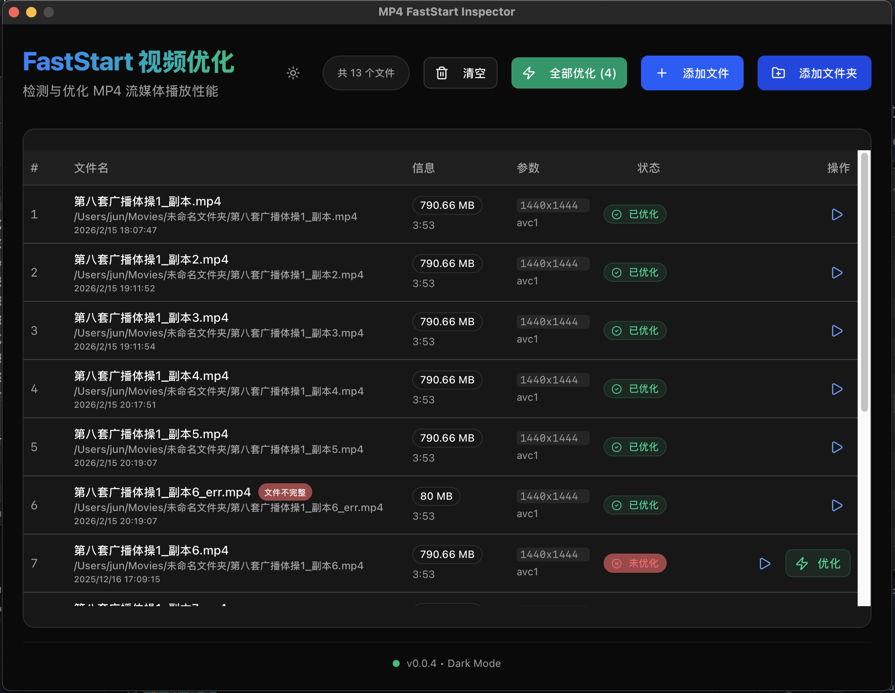

# MP4 FastStart 视频检测与优化工具

一款基于 Golang + Wails 开发的跨平台桌面应用，专为检测和优化 MP4 视频的流媒体播放性能（FastStart / moov atom 位置）而设计。




## ✨ 主要功能

*   **智能检测**：自动分析 MP4 文件的 `moov` 原子位置，直观显示无需优化的状态（绿色）或需要优化（红色）。
*   **一键优化**：将 `moov` 原子移动到文件头部，实现秒开播放。
    *   **安全机制**：自动创建 `.bak` 备份，优化成功并校验无误后自动删除备份，确保数据安全。
*   **批量处理**：支持拖拽文件、文件夹递归扫描，甚至“全部优化”按钮批量处理。
*   **本地预览**：内置视频播放器，支持直接预览本地视频（兼容中文及特殊字符路径）。
*   **原生体验**：
    *   **拖拽支持**：完美支持 Windows 和 macOS 的原生文件/文件夹拖拽。
    *   **主题切换**：支持浅色/深色（Light/Dark）模式切换，并自动保存偏好。
*   **中文界面**：全中文 UI 设计，包含详细的元数据展示（分辨率、编码、时长等）。

## 🛠 技术栈

*   **后端**：Golang 1.22+
*   **前端**：Next.js 15, React 19, Tailwind CSS v4, shadcn/ui
*   **框架**：Wails v2
*   **图标**：Lucide React

## 🚀 开发环境搭建

### 前置要求

*   [Go](https://go.dev/) (1.20+)
*   [Node.js](https://nodejs.org/) (npm)
*   [Wails CLI](https://wails.io/docs/gettingstarted/install) (`go install github.com/wailsapp/wails/v2/cmd/wails@latest`)

### 运行开发模式

```bash
# 进入项目目录
wails dev
```

该命令将启动 Go 后端服务和一个 Vite 前端开发服务器。前端代码修改支持热更新（HMR）。

## 📦 编译与构建指南

### 1. 编译 macOS 版本 (Native)

在 macOS 上编译原生的 `.app` 应用：

```bash
wails build
```

*   产物位置：`build/bin/MP4 FastStart Inspector.app`

### 2. 编译 Windows 版本 (Native)

在 Windows 系统上编译 `.exe` 应用：

```bash
wails build
# 或者隐藏控制台窗口（生产环境推荐）
wails build -ldflags "-H windowsgui"
```

*   产物位置：`build/bin/MP4 FastStart Inspector.exe`

### 3. macOS 交叉编译 Windows 版本 (Cross-Compile)

如果您正在使用 macOS，可以通过安装 `mingw-w64` 来交叉编译生成 Windows 可执行文件。

#### 步骤 1: 安装交叉编译工具

使用 Homebrew 安装 `mingw-w64`：

```bash
brew install mingw-w64
```

#### 步骤 2: 执行编译命令

专门针对 Windows `amd64` 架构进行编译。注意 Wails 会自动识别 mingw 编译器。

```bash
wails build -platform windows/amd64
```

*   产物位置：`build/bin/FastStartInspector.exe`
*   **注意**：生成的 `.exe` 文件可以直接传输到 Windows 电脑上运行。

## 📁 目录结构

```
.
├── build/                 # 编译产物及配置
├── frontend/              # 前端代码 (Next.js)
│   ├── src/app/           # 页面逻辑 (page.tsx)
│   └── ...
├── internal/              # 后端核心逻辑
│   ├── analyzer/          # MP4 原子分析
│   ├── optimizer/         # 优化与重写逻辑
│   └── bridge/            # Wails 桥接层
├── main.go                # 应用入口及配置
└── wails.json             # Wails 项目配置
```

## 🛰️ 自动升级部署指南 (Auto-Update Guide)

该应用内置了自动升级功能，支持从您的静态网站或对象存储（OSS/S3）获取更新。

### 1. 配置更新源

在发布前，请修改 `frontend/src/app/page.tsx` 中的 `updateUrl` 变量，将其指向您托管的 `latest.json` 地址：

```typescript
const updateUrl = "https://your-domain.com/updates/latest.json";
```

### 2. 准备升级元数据 (latest.json)

在您的服务器上创建一个名为 `latest.json` 的文件，内容格式如下：

```json
{
  "version": "1.0.1",
  "download_url_windows": "https://your-domain.com/updates/v1.0.1/FastStartInspector_v1.0.1.exe",
  "download_url_mac": "https://your-domain.com/updates/v1.0.1/FastStartInspector_v1.0.1_mac_bin",
  "release_notes": "1. 修复了 Windows 拖拽问题。\n2. 优化了转换速度。"
}
```

*   `version`: 新版本号（必须大于当前版本号才能触发升级）。
*   `download_url_windows`: Windows `.exe` 文件的下载直链。
*   `download_url_mac`: macOS **二进制文件** 的下载直链（注意：是 `.app` 包内的可执行文件，不是 `.app` 文件夹）。

### 3. macOS 特别说明

对于 macOS 的自动升级，由于 `minio/selfupdate` 替换的是正在运行二进制文件，因此您上传的不能是 `Application.app` 文件夹，而应该是编译出的二进制文件。

**如何获取 macOS 升级包：**
1. 执行 `wails build`。
2. 右键 `build/bin/MP4 FastStart Inspector.app` -> "显示包内容"。
3. 进入 `Contents/MacOS` 目录。
4. 找到名为 `FastStartInspector` 的文件（无后缀）。
5. 将此文件重命名为 `FastStartInspector_v1.0.1_mac_bin` 并上传。

### 4. 构建发布版本

构建时，您需要通过 `-ldflags` 注入版本号，以便应用知道当前是哪个版本。

**Windows:**
```bash
wails build -platform windows/amd64 -ldflags "-X main.Version=1.0.1"
```

**macOS:**
```bash
wails build -platform darwin/universal -ldflags "-X main.Version=1.0.1"
```

### 5. 部署流程总结

1.  **修改代码**：完成功能开发。
2.  **编译**：使用带版本号的命令编译（如 `1.0.1`）。
3.  **上传文件**：
    *   将生成的 Windows `.exe` 上传。
    *   将 macOS `.app/Contents/MacOS/FastStartInspector` 二进制文件上传。
4.  **更新 JSON**：修改服务器上的 `latest.json`，将 `version` 改为 `1.0.1` 并更新下载链接。
5.  **完成**：用户重启应用或点击“检查更新”时，即可检测到新版本。

### 6. 一键构建脚本 (推荐)

为了简化上述版本号注入、打包和重命名流程，项目提供了一个自动化脚本。它会自动完成 Windows 和 macOS 的构建，并生成准备好上传的 zip 包。

```bash
# 格式: ./scripts/build_release.sh [版本号]
./scripts/build_release.sh v0.0.3
```

脚本运行完成后，请打开 `dist/` 目录查看编译产物。 
## 📝 常见问题

**Q: 拖拽在 Windows 上没反应？**
A: 确保使用的是最新编译版本。我们已针对 WebView2 的拖拽机制进行了特殊优化，支持直接拖拽文件和文件夹。

**Q: 优化速度如何？**
A: 针对 Mac 系统和大文件进行了 I/O 优化，采用流式读写，速度极快且占用内存低。

## 📄 License

MIT
